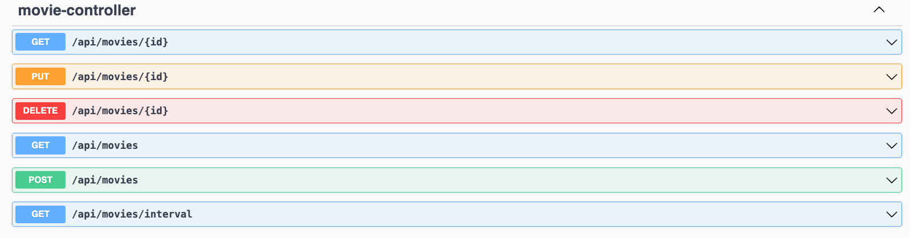

# Movie Application

A aplicação Movie Application, possibilitar a leitura da lista de indicados e vencedores da categoria Pior Filme do Golden Raspberry Awards.

## Tech Stack

Este projeto foi desenvolvido utilizando as seguintes tecnologias

**Application:** Java 21, Spring Boot 3.4.6, Spring Webflux, H2, R2DBC, OpenCVS, Lombok, Mapstruct,  Gradle

**Observabilidade:** Logstack


## Execuação via terminal

Acesso do diretório do projeto e execute o seguinte comando. Para encerrar a execução precione *CTRL+C*

```
./gradlew bootRun 
```

## Endereço da aplicação

A aplicação pode ser acessada pelo seguinte endereço.

[API Movies Application](http://localhost:8080/movie/api/movies)





Endereço de checagem de saúde da aplicação

[health](http://localhost:8080/movie/actuator/health)


## Execução de testes

Para a execução do testa integrado presente utilize o seguinte comendo

```
./gradlew clean test
```

## Documentação

Para acesso ao documentação do OpenApi acesso o link abaixo

[OpenApi (Swagger) => Movies Application](http://localhost:8080/movie/docs.html)

Importe a collection do postman que está no diretório **docs**

```
outsera - movies.postman_collection
```


## Execução conteinerizada

Para executar essa aplicação dentro de um conteiner docker, no diretório raiz execute o comando abaixo.

O parametro platform, é utilizando para processadores arm para Apple. Caso ocorra algum erro remova esse parametro.

Build Image
```
docker build --platform=linux/amd64 -f docker/Dockerfile -t outsera/movie-api .
```

Run Image
```
docker run --platform=linux/amd64 -d --name movie-api -i --rm -p 8080:8080 outsera/movie-api
```
## Authors

- [@romildojpaiter](https://www.github.com/romildojpaiter)

